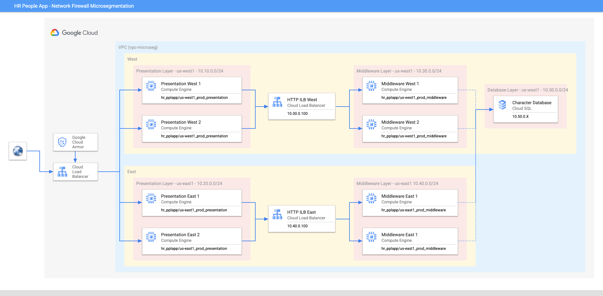

```
This is not an officially supported Google product.
This code creates PoC demo environment for CSA Network Firewall microsegmentation. This demo code is not built for production workload. 
```

# Demo Guide
This Cloud Security Architecture uses terraform to setup Firewall Micro-segmentation demo in a project and underlying infrastructure using Google Cloud Services like [Resource Manager - IAM Tags](https://cloud.google.com/resource-manager), [Cloud Firewall](https://cloud.google.com/firewall), [Cloud Armor](https://cloud.google.com/armor), [Cloud Compute Engine](https://cloud.google.com/compute) and [Cloud Logging](https://cloud.google.com/logging).


## Demo Architecture Diagram
The image below describes the architecture of CSA Firewall Micro-segmentation demo to protect against DDoS attack.




## What resources are created?
Main resources:
- Cloud Armor security policy (Owasp-web-application)
- One Gloabl Load-balancer and two internal load balancer in both regions 
- Health checks
- Two presentation layer frontend compute instance groups in both regions
- Two middleware layer backend compute instance groups in both regions
- One SQL database in primary region
- IAM tags for presentation, middleware and quaratine
- Firewall policies and rules to implement micro-segmentation 


## How to deploy?
The following steps should be executed in Cloud Shell in the Google Cloud Console. 

### 1. Create a project and enable billing
Follow the steps in [this guide](https://cloud.google.com/resource-manager/docs/creating-managing-projects).

### 2. Get the code
Clone this github repository go to the root of the repository.

``` 
git clone http://github.com/mgaur10/csa-fw-microsegmentation
cd csa-fw-microsegmentation
```

### 3. Deploy the infrastructure using Terraform

From the root folder of this repo, run the following commands:

```
export TF_VAR_organization_id=[YOUR_ORGANIZATION_ID]
export TF_VAR_microseg_project_id=[YOUR_PROJECT_ID]
terraform init
terraform apply
```

To find your organization id, run the following command: 
```
gcloud projects get-ancestors [YOUR_PROJECT_ID]
```

If you get Error: "Provider produced inconsistent final plan", then re-run the below commands to complete the deployment.
```
terraform apply
```


**Note:** All the other variables are give a default value. If you wish to change, update the corresponding variables in variable.tf file.


## How to clean-up?

From the root folder of this repo, run the following command:
```
terraform destroy
```


