```
This is not an officially supported Google product.
This code creates PoC demo environment for CSA Network Firewall microsegmentation. 
This demo code is not built for production workload. 
```

# Network Firewall Microsegmentation  Architecture Guide

# Summary

Network Firewall microsegmentation is a method used to apply the concept of least privilege to network elements in the cloud. It has the benefit of reducing the threat surface to only what is necessary for valid system functions, and can reduce lateral movement risk in the case of a breach. This architecture applies the microsegmentation concept to sources, destinations, protocols, and ports within the Google Cloud environment.


# Architecture 

A microsegmented cloud network begins by explicitly denying all communications ingress to and egress from all network elements. Building on this, we create a granular, positive security model which only allows required traffic flows.

## Design Diagram

The system we will be building is a 3-Tier application with Presentation, Middleware, and Database layers. For naming purposes, we will call this system the HR People App. It currently hosts the names of famous characters, and performances that they have been part of. The Presentation Layer pulls data from the Middleware Layer using a REST API call. The Middleware Layer pulls data from Cloud SQL using a database query.


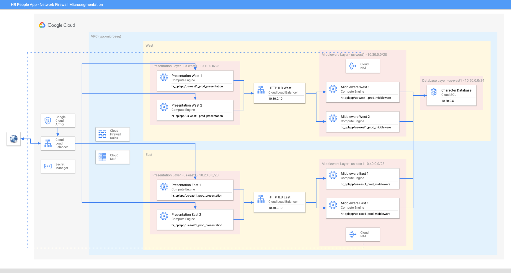

## Product and services

This architecture pattern leverages the following Google Cloud products:

-  [Virtual Private Cloud](https://cloud.google.com/vpc)
-  [Cloud Firewall](https://cloud.google.com/firewalls)
-  [Cloud DNS](https://cloud.google.com/dns)
-  [Compute Engine](https://cloud.google.com/compute)
-  [Cloud Load Balancing](https://cloud.google.com/load-balancing)
-  [Identity and Access Management](https://cloud.google.com/iam)
-  [Cloud SQL](https://cloud.google.com/sql)
-  [Cloud Armor](https://cloud.google.com/armor)
-  [Secret Manager](https://cloud.google.com/secret-manager)
-  [Cloud NAT](https://cloud.google.com/nat)


## Design considerations

The purpose of this architecture pattern is to demonstrate a least privileged, microsegmented network environment for an example 3-tier system. It does not aim to demonstrate other security concepts, such as encryption, principle of IAM roles least privilege, secure coding, database security, etc. This pattern does include an example Cloud Armor policy for consideration.

Components within this system are isolated from each other using Network Firewall. This pattern also limits access to and the Internet to minimize security risks. For example, Debian packages are retrieved using [Private Google Access](https://cloud.google.com/vpc/docs/configure-private-google-access) (Private API). Secret Manager is called to access the SQL database password via Private Google Access (Restricted API).

While we aim to keep all of our VM resources private, there are cases that arise where Internet access may be required. For example, a system may need to install a package, obtain a patch, or call home to a cloud monitoring service via the Internet. It can be difficult to determine which IP addresses are needed in firewall rule to support this, as IPs in a cloud-centric work are ever-changing. To avoid allowing outbound to large IP address ranges or even all IPs, we will demonstrate the use of Fully Qualified Domain Name (FQDN) firewall rule to restrict access. This is used by the Middleware layer upon startup to install the PHP Google Cloud Client Library for Secret Manager. The Cloud NAT service is restricted so that only the Middleware VMs can use it.

A Web Application Firewall (WAF) implementation is included to demonstrate how we can leverage a signature-based policy to protect our web app. This example deploys the ModSecurity Core Rule Set at Sensitivity (Paranoia) Level 3.


# Deployment

## Terraform Deployment Instructions

1. Open up Cloud shell and clone the [git repository](https://github.com/GoogleCloudPlatform/csa-fw-microsegmentation) using the command below.

```
git clone https://github.com/GCP-Architecture-Guides/csa-fw-microsegmentation.git
```

2. Navigate to the csa-fw-microsegmentation folder.

```
cd csa-fw-microsegmentation
```

3. ***Note: Skip to step-7 to use an existing project.*** Sign in to your organization and assign yourself the following roles:

- Billing Account User
- Folder Creator
- Project Creator
- The terraform assigns Storage Object Viewer role to the SQL database service account at project level.

The following steps should be executed in Cloud Shell in the Google Cloud Console. Unset any project using 'gcloud config unset project'


5. Provide the organization id and billing_account for project creation to deploy the architecture resources in the terraform variables. Edits can also be made directly in [variable.tf](variable.tf) file. The terraform will create a folder (CSA-Micro-Segment-xxxx) and a project (csa-micro-segment-xxxx) for the resources.

```
export TF_VAR_organization_id=[YOUR_ORGANIZATION_ID] # not required if using an existing project

export TF_VAR_billing_account=[YOUR_BILLING_ACCOUNT] # not required if using an existing project
```

6. To find your organization id, run the following command.

```
gcloud projects get-ancestors [YOUR_PROJECT_ID]
```

7. ***Optional Step*** to use an existing project. Sign in to your organization and assign yourself the following roles:

- Policy Tag Admin role at project level
- Editor role on the project to be used for the deployment. 
- The terraform assigns Storage Object Viewer role to the SQL database service account at project level.

8. ***Optional Step*** to use an existing project. Provide the project_id to be used to provision resources Edits can also be made directly in [variable.tf](variable.tf) file.

```
export TF_VAR_csa_project_id=[YOUR_EXISTING_PROJECT_ID]
export TF_VAR_create_new_project=false

```

9. While in the csa-fw-microsegmentation, run the commands below in order. 

```
gcloud config unset project # to unset any set project

terraform init

terraform plan

terraform apply

Note: This will take approximately 25-30 minutes to complete.
```

> If prompted, authorize the API call.

    If you get an error message "Error: Provider produced inconsistent final plan", then re-run the "`terraform apply`" command to complete the deployment. This is a known Terraform bug.

```
terraform apply
```

Note: All the other variables are given a default value. If you wish to change, update the corresponding variables in the [variable.tf](variable.tf) file.

9. The following image shows the firewall policy that will be applied to the project's VPC.

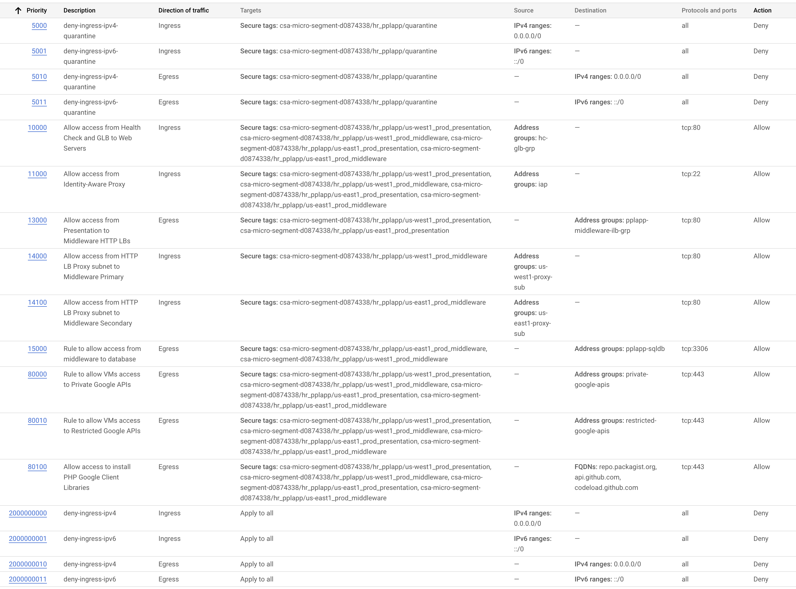
    
   
11. To clean-up and destroy all the created resources run the following command from the root folder of this repo.

```
terraform destroy
```

# Best Practices

### IAM-Governed Tag Structure

To leverage IAM-governed tags for network microsegmentation, we need to uniquely describe our network elements using key:value pairs. Since a key:value will be used to apply microsegmentation rules, they should identify system components to the finest possible granularity. The following naming convention is proposed as an example (light gray components are optional):

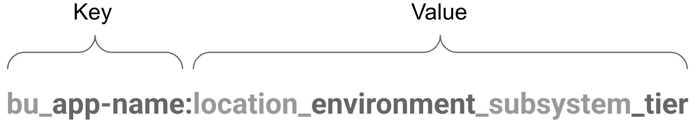

As a practical example, consider the following key:value for the SAP Workday database, supporting HR in the us-east1 environment.

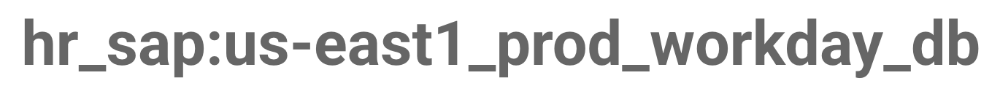

This tagging structure could change, depending on various factors within the target environment. For example, perhaps the business unit is known via the folder name, the same rules are to be applied to system components in all locations, or there are not multiple subsystem components.


# Operations

## Logging

Logging is extremely useful for monitoring, auditing activities, and troubleshooting when things go wrong. We can log network traffic at the firewall layer, the VPC layer, and the load balancer layer. Cloud Armor logs are included in the load balancer log data. Log data can be viewed within [Logs Explorer](https://console.cloud.google.com/logs/) in the GCP console.

To view firewall logs, use the following query (_replace PROJECT_ID with your ID_):

```
resource.type="gce_subnetwork"
logName="projects/PROJECT_ID/logs/compute.googleapis.com%2Ffirewall"
```

Firewall logs contain useful information about the connections being made to and from our resources and the actions applied to the connections. You should notice lots of  denied traffic in a microsegmented environment, because we explicitly deny all traffic in and out. Denied traffic could notify us that the system is protecting itself as usual. It could also provide signs that systems are misconfigured and are attempting connections that are not intended. It could also help us identify why our system is not functioning properly. Say we wanted to troubleshoot why one of our Middleware VMs in us-east1 can't make an outbound connection. Since our microsegmentation design includes logging on the outbound deny rule, we can query it:

```
resource.type="gce_subnetwork"
logName="projects/PROJECT_ID/logs/compute.googleapis.com%2Ffirewall"
jsonPayload.disposition="DENIED"
jsonPayload.connection.src_ip="10.40.0.2"
```

More details about specific firewall log data is available on the [Firewall Rules Logging](https://cloud.google.com/vpc/docs/firewall-rules-logging) page.

To view VPC flow logs, use the following query (_replace PROJECT_ID with your ID_):

```
resource.type="gce_subnetwork"
logName="projects/PROJECT_ID/logs/compute.googleapis.com%2Fvpc_flows"
```

VPC flow logging samples flows to and from VMs.This is helpful to get a sense of the sessions occurring in our environment, what is communicating to what, along with start and end times. More details are available within the [VPC Flow Log](https://cloud.google.com/vpc/docs/flow-logs) documentation.

To view Cloud Armor logs, use the following query:

```
resource.type="http_load_balancer"
jsonPayload.enforcedSecurityPolicy.name="armor-microseg"
```

The Cloud Armor logs contain important information on which client IPs are accessing our resources, what they are accessing, and the security outcome of Cloud Armor's analysis. For example, the logs will show a POST request from a client IP to a particular URL that has been denied due to a WAF signature in blocking mode. More details are available on the [Request Logging](https://cloud.google.com/armor/docs/request-logging) page.


## Monitoring, Alerting, and Reporting

One way to monitor a microsegmented environment is to look at the number of firewall denies. An unusual amount of firewall denies to or from particular resources could indicate a compromise attempt. It could also indicate a misconfiguration. In the screenshot below, you can see a chart showing egress denies, focusing in on the data for a particular VM.

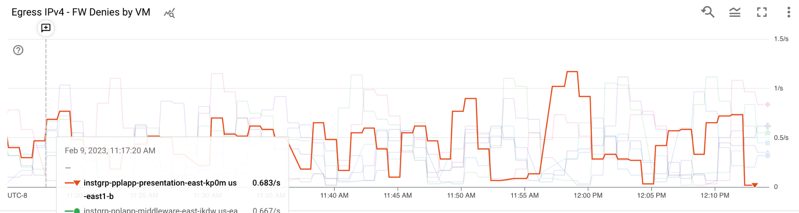

Monitoring dashboards also have a Logs Panel type. We can use it to display firewall logs in our microsegmented environment. Below, we have an example of a log panel displaying firewall deny logs.

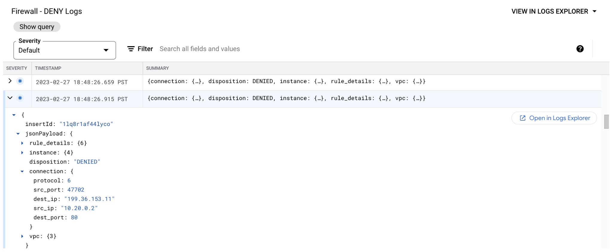

Cloud Armor information can also be monitored, to get a sense of incoming threats. For example, we can use a dashboard to monitor the number of rule blocks and provide a view into its deny logs.

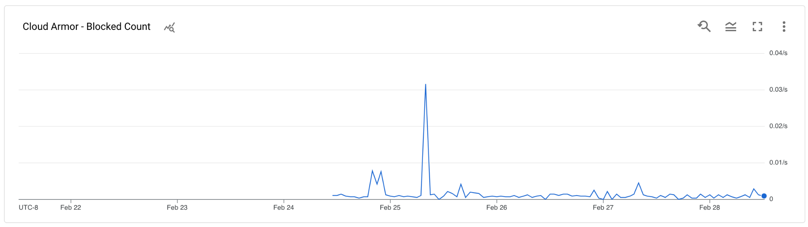


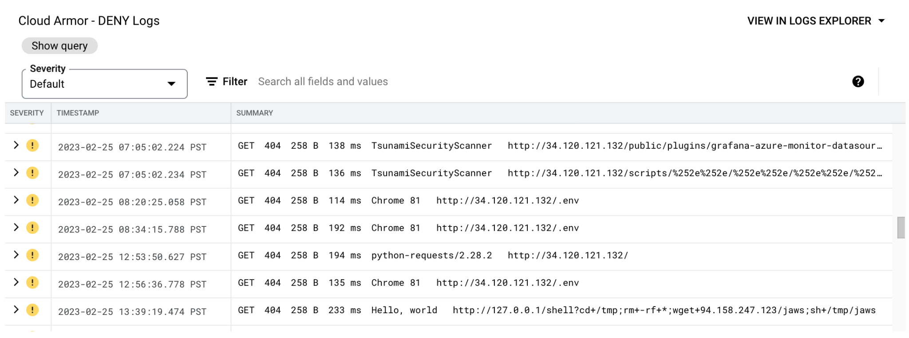

An example Monitoring Dashboard can be loaded into your environment, by uploading [this YAML file](https://github.com/GCP-Architecture-Guides/csa-fw-microsegmentation/blob/main/images/dash.yaml) to your Cloud Shell and executing the following command within your desired project:

```
gcloud monitoring dashboards create --config-from-file dash.yaml
```

The dashboard with look like this:

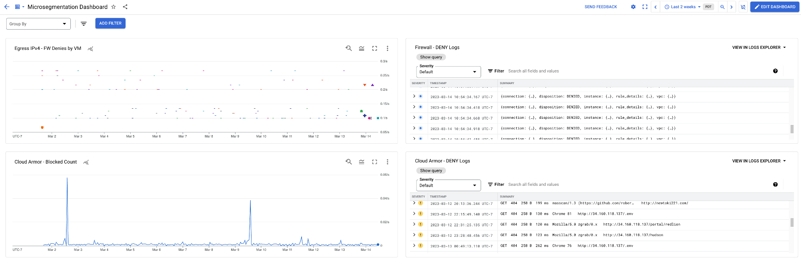


## Digital Forensic and Incident Response

In the case that a VM is suspected or known to be compromised, an organization may wish to quarantine it. This is a simple task using firewall rules. In this guide, we prepopulated the ‘hr_pplapp' tag key with the value ‘quarantine'. We also built high priority firewall rules that deny IPv4 and IPv6 traffic in and out of VMs tagged with ‘hr_pplapp:quarantine'. Here is what these rules look like in the GUI:

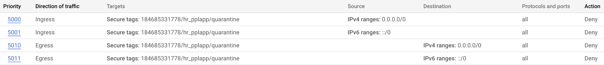

In the case that a VM needs to be quarantined, it can be tagged accordingly. To do this in the GUI:

- Navigate to Compute Engine -> VM Instances
- Click on the name of the instance you wish to quarantine.
- Under ‘Basic Information', click the edit   button in the ‘Tags' row.
- Click Add Tag. Select the value ‘quarantine' under the existing key ‘hr_pplapp'.

At this point the VMs tagged with key/value "hr_pplapp:quarantine" are isolated from the rest of the VPC or any egress traffic. Script and/or automate the above configuration in your incident playbooks to quarantine the VMs, then connect your Digital Forensics and Incident Response (DFIR)  tools for investigation.


# Governance, Risk Management, and Compliance

The architecture in this doc applies zero-trust between different workload resources, this design increase the Zero-Trust maturity level as defined by CISA (Cybersecurity and Infrastructure Security), see "Pilar #3 Network/Environment" in the [Zero Trust Maturity Model draft](https://www.cisa.gov/sites/default/files/publications/CISA%20Zero%20Trust%20Maturity%20Model_Draft.pdf).

Users can look up which tags are applied to which VMs by leveraging Asset Inventory. In the Resource tab, we can search for VMs that use a particular key:

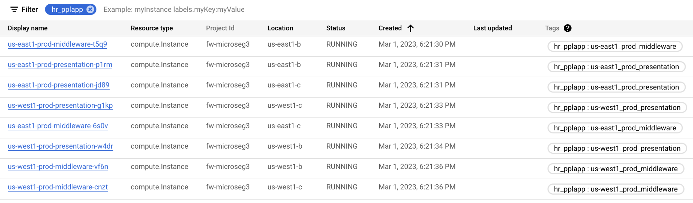

We can also narrow down our search to a particular key:value pair:

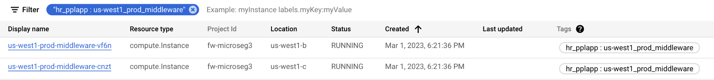

To Add: **Tag User vs tag administrator vs compute admin for separation of roles.**

# Cost

Please see the estimated monthly cost to run this demonstration environment, below. Note, this has been estimated at the time of pattern creation, the estimate may change with time and may vary per region, please review the cost of each resource at [Google Cloud Pricing Calculator](https://cloud.google.com/products/calculator).

<table>
  <thead>
    <tr>
      <th><strong>GCP Service</strong></th>
      <th><strong>Type</strong></th>
      <th><strong>Cost USD / month</strong></th>
    </tr>
  </thead>
  <tbody>
    <tr>
      <td>Compute</td>
      <td>f1-micro, on-demand, 4 us-west1, 4 us-east1</td>
      <td>$39.04</td>
    </tr>
    <tr>
      <td>SQL Database</td>
      <td>MySQL, 1 vCPU, 3.75 GB RAM, 10 GB HDD, HA</td>
      <td>$100.42</td>
    </tr>
    <tr>
      <td>Cloud Armor</td>
      <td>1 policy, 16 rules, up one 1,000,000 requests</td>
      <td>$21.75</td>
    </tr>
    <tr>
      <td>Cloud DNS</td>
      <td>2 managed zones, up to 1,000,000 queries </td>
      <td>$1.20</td>
    </tr>
    <tr>
      <td>Global Load Balancer</td>
      <td>1 forwarding rule, up to 1 GB inbound and up to 1 GB outbound</td>
      <td>$18.62</td>
    </tr>
    <tr>
      <td>Logging (FW, VPC Flow)</td>
      <td>Up to 5 GiB ingested, stored no more than 30 days</td>
      <td>$2.50</td>
    </tr>
    <tr>
      <td><strong>Total</strong></td>
      <td></td>
      <td>$183.53</td>
    </tr>
  </tbody>
</table>


# Related Resources

[Network Firewall Policies](https://cloud.google.com/vpc/docs/network-firewall-policies): This documentation describes the network firewall features and differentiates them from VPC firewall rules.

[Tags for Firewalls](https://cloud.google.com/vpc/docs/tags-firewalls-overview): This documentation provides details about tags as they relate to use with network firewalls.

[Cloud Armor Overview](https://cloud.google.com/armor/docs/cloud-armor-overview): This documentation describes the Cloud Armor product and how to configure its many features. While this guide demonstrates a WAF implementation, Cloud Armor provides many more rich features that can be explored like Threat Intelligence, rate limiting, custom rules, and reCAPTCHA integration.

